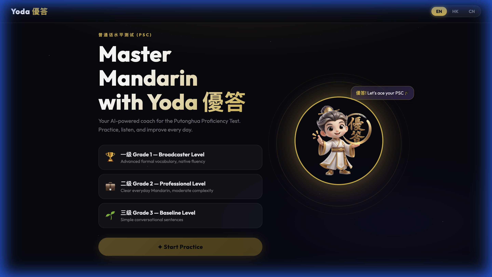
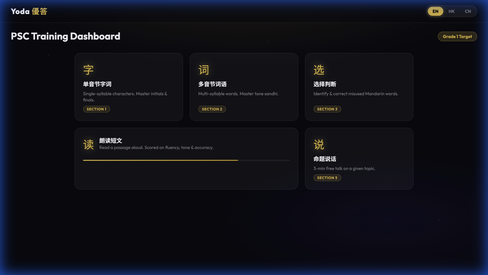
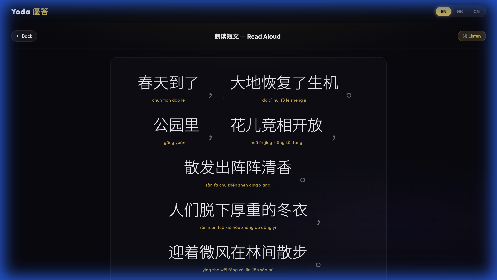

# 🧙 Yoda 優答 — GenAI Putonghua Mentor

> **您的普通話水平測試 AI 專屬教練**
> Your AI-powered real-time coach for the Putonghua Proficiency Test (PSC)



---

## What is Yoda 優答?

Yoda 優答 is a full-stack web app that helps you prepare for the **PSC (普通話水平測試)** — the official Putonghua proficiency test used for teachers, broadcasters, and civil servants in Greater China.

It listens to your voice, scores your pronunciation using the same rubric as the real exam, and gives you instant personalised feedback — powered by **Azure OpenAI** and the **iFLYTEK ISE** engine.

---

## Screenshots

| Dashboard | Exercise Screen |
|---|---|
|  |  |

---

## Features

- 🎯 **5 Official PSC Sections** — 单音节字词, 多音节词语, 选择判断, 朗读短文, 命题说话
- 🤖 **AI Sentence Pool** — Azure OpenAI generates fresh practice content per grade, refills automatically
- 🎤 **Real-Time Pronunciation Scoring** — iFLYTEK ISE scores Tone, Fluency, Phonetics & Integrity
- 🔊 **Native vs. My Voice** — Compare TTS native audio with your own recorded playback
- 🀄 **Word-Grouped Pinyin** — Pinyin shown under whole words, not per character
- 📊 **AI Report Card** — Full session analysis with error breakdown and improvement tips
- 🧙 **Mascot Reaction Popups** — Yoda reacts differently based on your score (4 images)
- 🏆 **Confetti Modal** — Triggers on ≥ 95 score
- 3️⃣ **Grade Modes** — Grade 1 (broadcaster), Grade 2 (professional), Grade 3 (baseline)

---

## Tech Stack

| Layer | Technology |
|---|---|
| Backend | Node.js, Express.js |
| Real-time | Socket.IO (WebSocket) |
| AI Generation | Azure OpenAI (GPT-4o) |
| Pronunciation Scoring | iFLYTEK ISE API |
| Audio Capture | Web Audio API, PCM → 16kHz |
| Audio Playback | SpeechSynthesis + WAV encoding |
| Frontend | Vanilla JS, HTML5, CSS3 |

---

## Getting Started

### Prerequisites
- Node.js ≥ 18
- Azure OpenAI API key + endpoint
- iFLYTEK ISE API credentials (APPID, APIKey, APISecret)

### Setup

```bash
git clone https://github.com/pranavi-apk/yoda-psc.git
cd yoda-psc
npm install
```

Open `server.js` and fill in your credentials at the top:

```js
const AZURE_OPENAI_ENDPOINT = "your-endpoint";
const AZURE_OPENAI_KEY      = "your-key";
const ISE_APPID             = "your-appid";
const ISE_API_KEY           = "your-apikey";
const ISE_API_SECRET        = "your-apisecret";
```

### Run

```bash
node server.js
```

Open [http://localhost:3000](http://localhost:3000) in your browser.

---

## Project Structure

```
yoda-psc/
├── server.js          # Express + Socket.IO backend, Azure OpenAI & ISE integration
├── package.json
├── PROPOSAL.md        # Project proposal (problem, solution, implementation plan)
└── public/
    ├── index.html     # Single-page app shell
    ├── client.js      # All client-side logic & audio handling
    ├── style.css      # Premium dark theme + animations
    └── assets/        # Mascot images + screenshots
```

---

## Score → Yoda Reaction

| Score | Reaction |
|---|---|
| < 50 | 😤 Try Again Yoda |
| 50–69 | 🙂 Right Yoda |
| 70–94 | 😊 Good Yoda |
| ≥ 95 | 🏆 Yoda + confetti |

---

*Yoda 優答 — 以練代測，優答每道題。*
